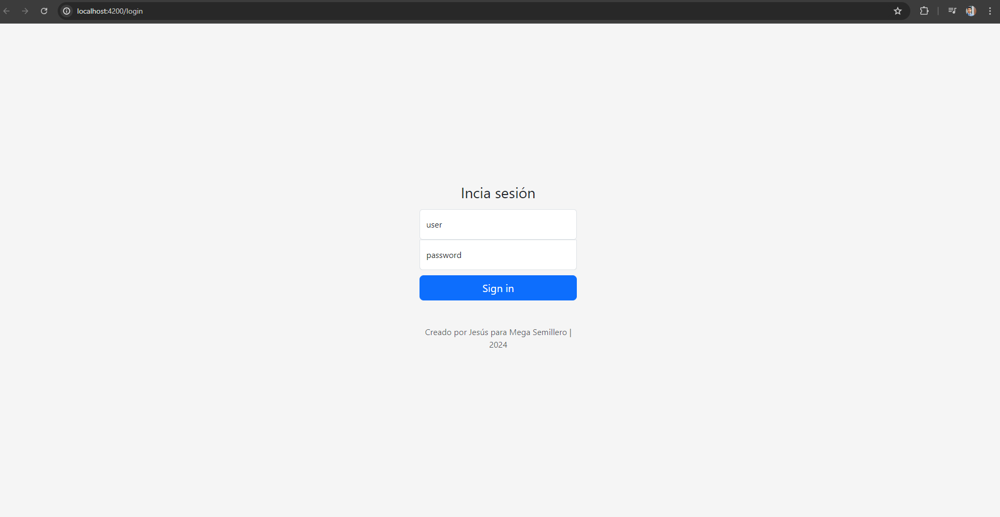
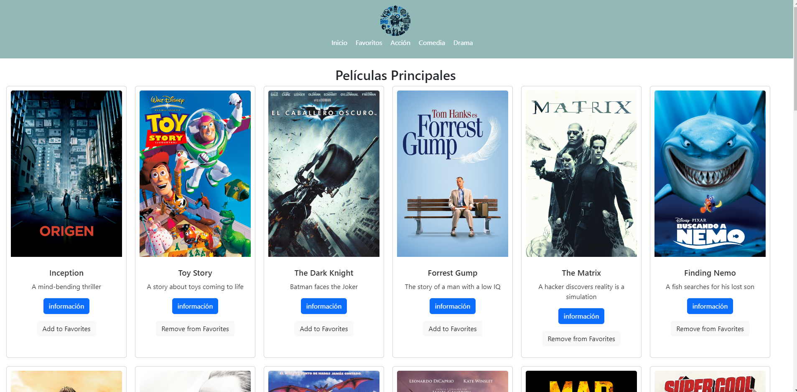
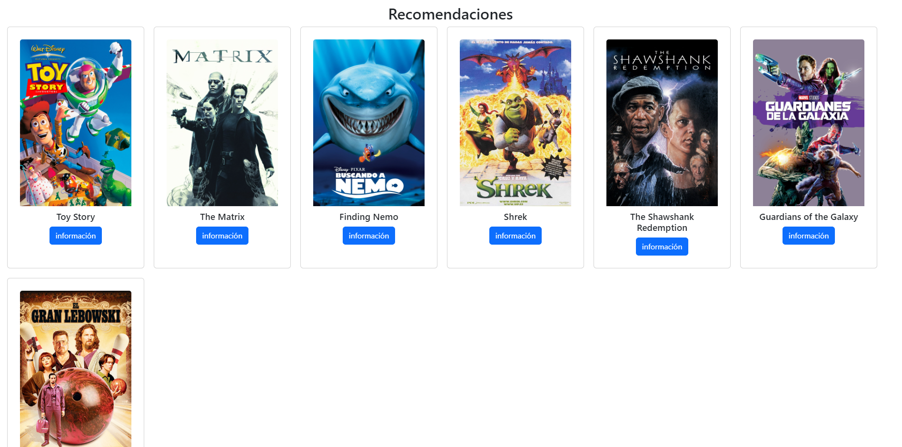
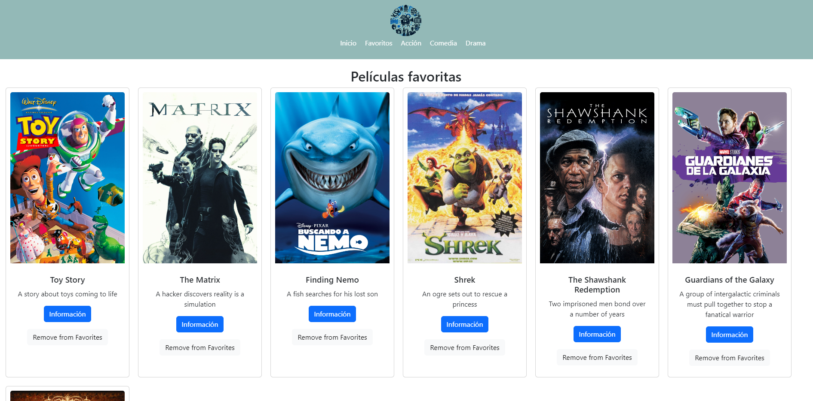
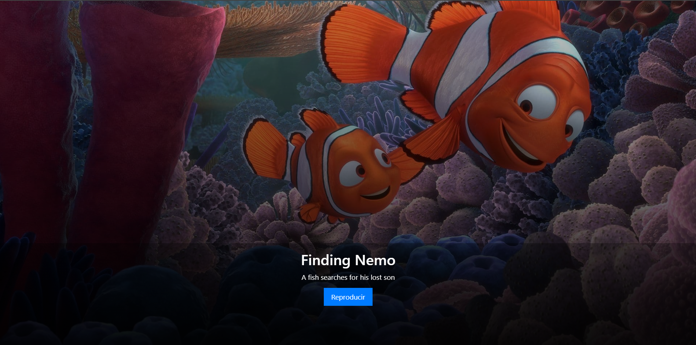

# Hub de entretenimiento
## Jesús Rivera Piceno
### Resumen del proyecto
Este proyecto es un Hub de Entretenimiento desarrollado con fines de evaluación para Mega Semillero. Consiste en una SPA desarrollada con Angular, en la cual se muestran películas, se pueden agregar o quitar de favoritos, una vista de detalles y un login simulado.
___

### Requerimientos técnicos
- Node v20.13.1
- npm v10.5.2
- Angular CLI 18.1.0
- TypeScript v5.5.2
- Bootstrap v5.3.3

___
### ¿Cómo instalar?
1. instala Node JS en su versión actual [nodejs.org](https://nodejs.org/en "nodejs.org")
2. Entrar al repo [TrePiceno](https://github.com/TrePiceno "Repo de Jesus")
3. Clonar copiar vinculo para clonarlo
4. Crear una carpeta y abrirla en VSC
5. Abrir terminar y ejecutar el comando con el vinculo *git clone https://github.com/TrePiceno/HubEntretenimientoMega.git*
6. comando *cd entertainment-hub* 
7. instala Angular CLI desde la terminal con el comando *npm install -g @angular/cli*
8. ejecutar comando *npm install*
9. Ejecuta el comando *ng serve*
10. En el resultado de la terminal indica el puerto [localhost](http://localhost:4200/) , puedes copiarlo y pegarlo en el navegador, puedes presionar ctrl y dar click en el enlace o puedes agregarlo manualmente en la barra de direcciones del navegador
11. En el login agrega *user* y *password* respectivamente en los campos y presiona Entrar
12. ¡Listo! ya podrás navegar en el sitio.

---
### Capturas de pantalla

En la primer vista tenemos un login simulado, para acceder al sitio es necesario agregar en el campo user la misma palabra *user* y lo mismo para el campo de password *password*

En la vista del home, tenemos el catálogo principal del sitio.

Igualmente bajando, tenemos una sección de películas recomendadas

En esta vista tenemos aquellas películas que se añadieron a favoritos por el usuario

Para cada película tenemos una vista al dar click en información que nos muestra una imagen diferente y un botón de reproducir
___
### Proceso de desarrollo
Primera vez que trabajo con Angular, estuve entrando al curso de Udemy, siguiendo el proceso, sin embargo tuve problemas como que no me generaba algun archivo que luego se tenia que modificar, entre a internet a buscar soluciones, vi tutoriales en Youtube, consulte con ChatGPT y Gemini. TypeScript también es algo nuevo para mi, su sintaxis también represanta un reto, aunque lo encuentro algo amigable. Mis momentos de trabajo se limitan debido a varios factores, estudio la ingenieria en sistemas y soy freelance, me dedico a la reparación y venta de equipos de cómputo. Debido a que es mi única fuente de ingresos, de momento no puedo pausarlo o dejarlo, por lo tanto me dedico al estudio incluido esto, por las noches. Diria que es pesado, pero lo disfruto, me gusta mucho la tecnología y me gusta sobremanera aprender cosas nuevas. Estoy satisfecho con el resultado y quiero seguir aprendiendo.
___
### Sprint Review
| ¿Qué salió bien? | ¿Qué puedo hacer diferente? | ¿Qué no salió bien? |
|------------------|:---------------------------:|--------------------:|
|Trabajar con Angular ha sido, toda una experiencia, he entenido como se estructura un sitio con este framework, las directivas, las rutas y la creación de componentes|Dedicar más tiempo a estudiar y practicar para entender mejor las cosas y pasar menos tiempo corrigiendo errores |No logre usar las imágenes de manera local, por más que revisaba la ruta, cambiaba de ubicación la carpeta, no aparecian, aunque con la extensión de *image preview* de VSC si. Tuve que usar links externos para poder mostrarlas. Tengo mucho por pulir aún. Por otro lado, llevo retraso con el tercer Sprint.|
